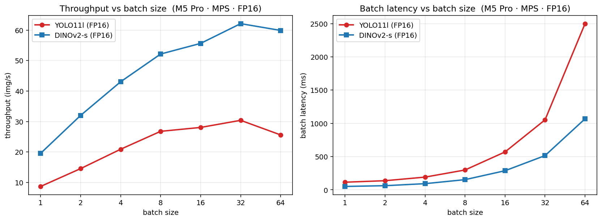

# Inference benchmark — M5 Pro (MPS · FP16)

**Setup:** Apple M5 Pro, MPS backend, FP16 for both models. Single-instance: 100 reps after 5 warm-up. Throughput: ~96 images / batch-size, 3 warm-up batches.

## Summary

| model | params | peak throughput | input | p50 latency | p95 | weights (FP16) |
|---|---:|---:|---|---:|---:|---:|
| YOLO11l (detector)        | 25.3M | **30.4 img/s** @ bs=32 | 640×640 | **78 ms** | 83 ms | 48 MB |
| DINOv2-small (trench gate)| 22.1M | **62.1 img/s** @ bs=32 | 224×224 | **114 ms** | 123 ms | 42 MB |

## Throughput by batch size

| batch | YOLO11l (img/s) | DINOv2-s (img/s) | YOLO batch latency | DINOv2 batch latency |
|---:|---:|---:|---:|---:|
| 1 | 8.7 | 19.6 | 115 ms | 51 ms |
| 2 | 14.5 | 32.0 | 137 ms | 62 ms |
| 4 | 20.9 | 43.1 | 191 ms | 93 ms |
| 8 | 26.8 | 52.2 | 299 ms | 153 ms |
| 16 | 28.1 | 55.7 | 570 ms | 288 ms |
| 32 | 30.4 | 62.1 | 1053 ms | 515 ms |
| 64 | 25.6 | 59.9 | 2500 ms | 1068 ms |

## Memory (FP16 weights, No Quantization)

- **YOLO11l:** 25.3M × 2 B = **48 MB** weights. Activations add ~2–4× at typical batch sizes.
- **DINOv2-s:** 22.1M × 2 B = **42 MB** weights.

## Plot (FP16 weights, No Quantization)

## Notes

- YOLO11l (25.3M) is the *large* variant; `yolo11x` (~57M) is the extra-large and isn't benchmarked here.
- DINOv2 in FP16 on MPS occasionally emits sklearn matmul warnings (extreme embedding values flipping a small fraction of head predictions). Speed is unaffected; for production accuracy set `OEPENTRENCH_TRENCH_CLASSIFIER_NO_FP16=1` to fall back to FP32.
- Throughput peaks at **bs=32** for both models; bs=64 *drops* due to MPS memory pressure / fragmentation.
- Single-instance latency includes file I/O; throughput uses pre-loaded PIL images (GPU-only).
