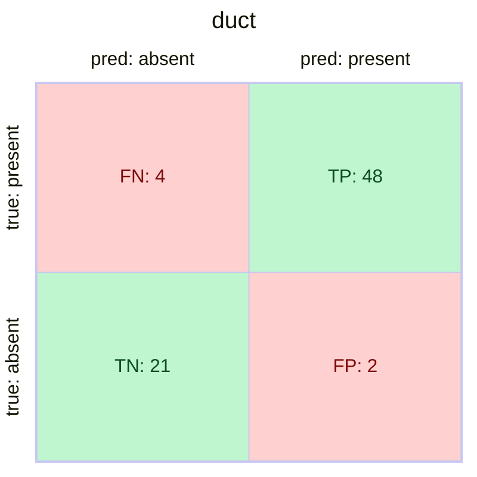

# Image-level binary presence — duct + ruler (whitepaper excluded)

**Weight:** `weights/yolo11l-aug.pt` (deg15, commit `5c4d07b`)
**Test set:** `project-resources/custom-datasets/duct-and-ruler-manual/detection/images/test` (75 images)
**Inference conf:** 0.10

| class | TP | FP | FN | TN | precision | recall | F1 | accuracy |
|---|---:|---:|---:|---:|---:|---:|---:|---:|
| **duct**  | 48 | 2 | 4 | 21 | 0.923 | 0.960 | **0.941** | **0.920** |
| **ruler** | 38 | 0 | 12 | 25 | **1.000** | 0.760 | 0.864 | 0.840 |

## Confusion matrices

### duct

|                    | **pred: absent** | **pred: present** |
|--------------------|---:|---:|
| **true: absent**   | 🟩&nbsp;TN&nbsp;= 21 | 🟥&nbsp;FP&nbsp;= 2 |
| **true: present**  | 🟥&nbsp;FN&nbsp;= 4 | 🟩&nbsp;TP&nbsp;= 48 |

### ruler

|                    | **pred: absent** | **pred: present** |
|--------------------|---:|---:|
| **true: absent**   | 🟩&nbsp;TN&nbsp;= 25 | 🟥&nbsp;FP&nbsp;= 0  |
| **true: present**  | 🟥&nbsp;FN&nbsp;= 12 | 🟩&nbsp;TP&nbsp;= 38 |

